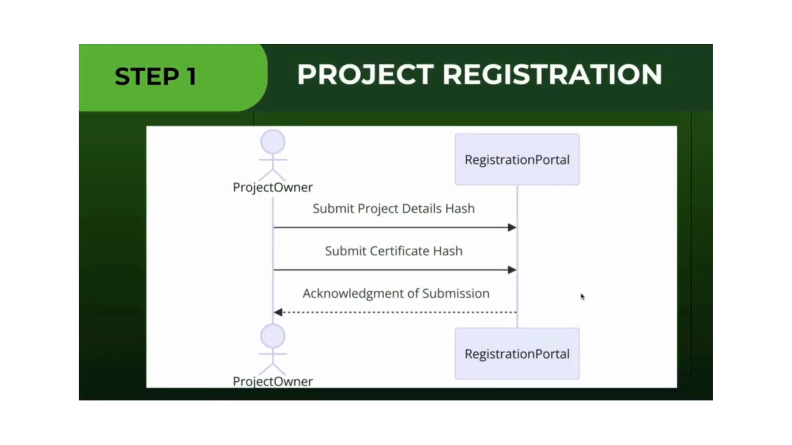
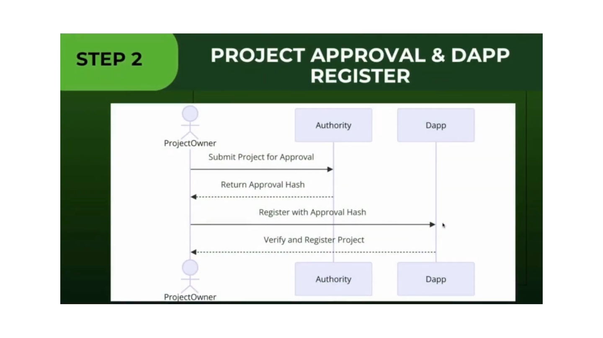
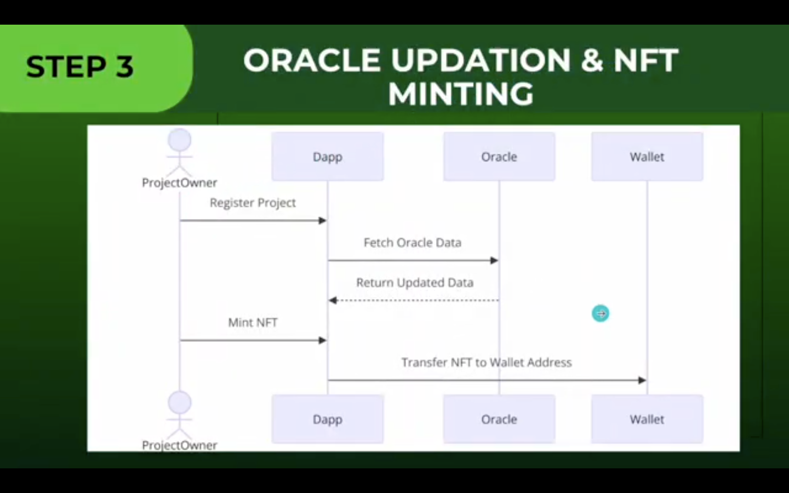
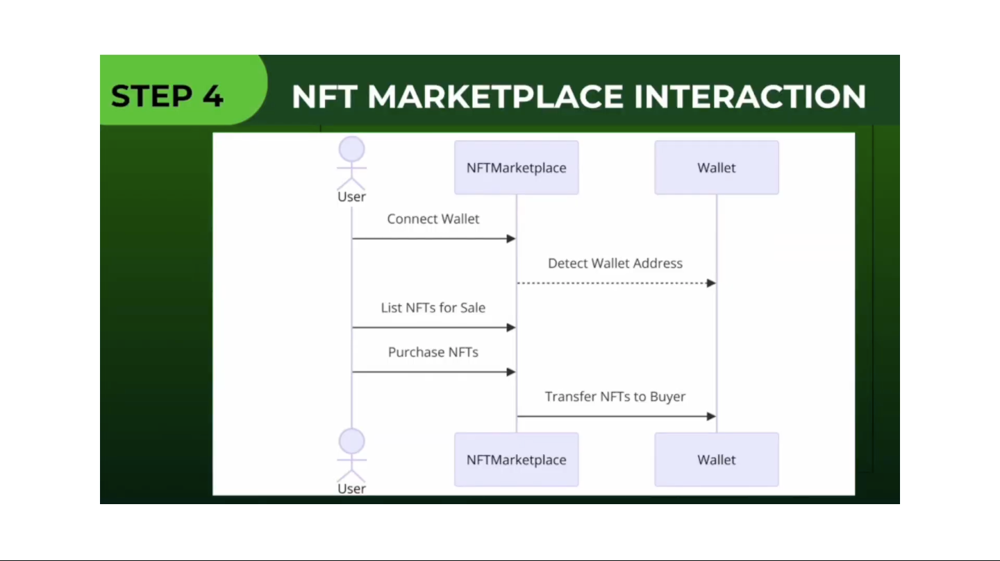

# Carbon Credit Marketplace

## Overview

The Carbon Credit Marketplace is a decentralized platform for trading carbon credits. The project is built using Ethereum smart contracts(using Hardhat), Node.js, MongoDB, and React.

## Project Structure

```plaintext
carbon-credit-platform/
│
├── backend/                  # Backend (Node.js + Express + MongoDB)
│   ├── src/
│   ├── package.json
|   ├── .env
│   └── ...
│
├── frontend/                 # Frontend (React.js)
│   ├── public/
│   ├── src/
│   ├── package.json
│   ├── .env
|   └── ...
│
├── smart-contracts/          # Smart Contracts (Hardhat)
│   ├── contracts/
│   ├── scripts/
│   ├── test/
│   ├── hardhat.config.js
|   ├── .env
│   └── ...
│
├── package.json              # Root package.json (shared dependencies)
├── README.md                 # Project documentation
├── .env
└── ...
```

## Prerequisites

Ensure you have the following installed on your system:

- [Node.js](https://nodejs.org/) (v14.x or higher)
- [npm](https://www.npmjs.com/) or [yarn](https://yarnpkg.com/)
- [Git](https://git-scm.com/)
- [Hardhat](https://hardhat.org/) (for smart contract development)

## Installation

### 1. Clone the Repository

```bash
git clone https://github.com/SrinivasYD/CarbonCredits.git
cd CarbonCredits
```

### 2. Install Root Dependencies

```bash
npm install
```

### 3. Set Up Backend

Navigate to the `backend` directory, install dependencies, and start the server:

```bash
cd backend
npm install
npm start
```

> **Note:** You may need to configure environment variables such as `MONGODB_URI` in a `.env` file in the `backend` directory.

### 4. Set Up Smart Contracts

Navigate to the `smart-contracts` directory, install dependencies, and compile the contracts:

```bash
cd ../smart-contracts
npm install
npx hardhat compile
```

To deploy the smart contracts, you can run:

```bash
npx hardhat run scripts/deploy.js --network sepolia
```

Replace `<network_name>` with the desired network (e.g., `localhost`, `rinkeby`, `sepolia`, etc.).

### 5. Set Up Frontend

Navigate to the `frontend` directory, install dependencies, and start the React application:

```bash
cd ../frontend
npm install
npm start
```

The frontend will be available at `http://localhost:3000`.

## Usage

1. **Backend**: The backend server will run on `http://localhost:5000`.
2. **Frontend**: The React frontend will run on `http://localhost:3000`.
3. **Smart Contracts**: Deploy your smart contracts and integrate them with the frontend using web3.js or ethers.js.

## Testing

### Backend

You can add tests to the `backend` and run them using:

```bash
npm test
```

### Smart Contracts

To run the tests for the smart contracts, navigate to the `smart-contracts` directory:

```bash
cd smart-contracts
npx hardhat test
```

## Sequence Diagram of the Project

### 🖼️ **Step 1: Project Registration**



### 🖼️ **Step 2: Project Approval & Dapp Registration**



### 🖼️ **Step 3: Oracle Updation & NFT Minting**



### 🖼️ **Step 4: NFT Marketplace Interaction**



### 📽️ Demo: Carbon Credits NFT Marketplace

🔗 [Watch the Demo Video](https://drive.google.com/file/d/18Gz9BzF9v_jQi8Vlm-SoCvozb5VEnPj9/view)
